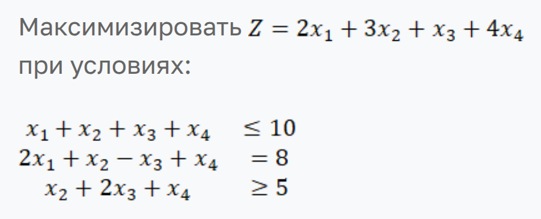
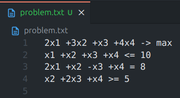
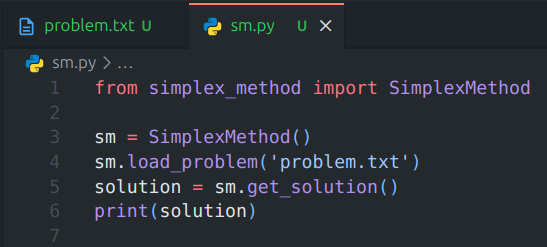
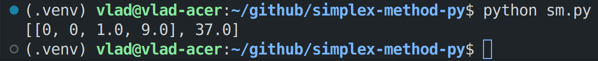
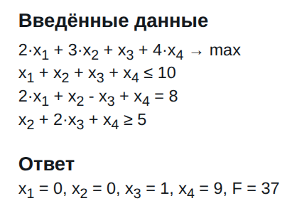

# Задание №1. Разработка программного обеспечения для решения задачи линейного программирования

## Ф.И.О.

Клименков Владислав Максимович

## Поток

МЕТОПТ 1.2

## Краткое описание механизма работы программы

> Алгоритм решения ЗЛП, реализованный в рамках данной программы, основан на алгоритме, описанном на следующем [сайте](https://programforyou.ru/calculators/simplex-method).

Если описывать кратко, то процесс работы программы по решению ЗЛП можно разбить на следующие этапы:

1. Программа получает на вход txt-файл с записью ЗЛП в соответствующем формате (сам формат будет подробнее разобран ниже).
2. Программа извлекает из txt-файла параметры ЗЛП, преобразя их в удобный для компьютерной обработки формат (по большей части представленный одинарными и двойными списками).
3. Программа приводит ЗЛП к каноническому виду, заменяя у ограничений операторы `<=` и `>=` на `=` путём добавления дополнительных переменных (для приведения `<=` к `=`) и, при необходимости, домножения на `-1` (для приведения `>=` к `<=`). Добавленные дополнительные переменные также становятся частью базиса.
4. Программа составляет симплекс-таблицу, которая представляет из себя матрицу с коэффициентами ограничений, а также свободными членами `b`.
5. Если дополнительных переменных не хватает для формирования полного базиса, то программа доводит базис до полного путём приведения первых подходящих столбцов к единичному виду.
6. Программа избавляется от отрицательных свободных коэффициентов `b`.
7. Программа рассчитывает дельты для столбцов симплекс-таблицы и с помощью данных дельт проверяет решение на оптимальность (при минимизации в симплекс-таблице должны отсутствовать положительные дельты, при максимизации - отрицательные). Если решение не является оптимальным, то запускается цикл оптимизации решения с помощью симплекс-отношений `Q`, пересчёта дельт и повторной проверки. Цикл продолжается до тех пор, пока не будет найдено оптимальное решение или не будет доказано, что оптимального решения не существует (при отсутствии симплекс-отношений `Q`).
8. После нахождения оптимального решения, программа извлекает полученные значения переменных, рассчитывает значение целевой функции и возвращает данные результаты пользователю.

## Инструкция по запуску программы

> Для запуска программы требуется установленный интерпретатор `Python`.

Вся программа полностью реализована в рамках класса `SimplexMethod`, расположенного в файле `simplex_method.py`. Для работы программы требуется создать python-файл и в нём импортировать класс `SimplexMethod`:

```python
from simplex_method import SimplexMethod
```

Для работы с классом `SimplexMethod` нужно создать его экземпляр:

```python
sm = SimplexMethod()
```

В классе `SimplexMethod` для внешнего использования предназначены всего два метода:

- `SimplexMethod.load_problem(file_path: str) -> None)`: Метод для загрузки ЗЛП.
- `SimplexMethod.get_solution() -> list[list[int] | int])`: Метод для получения решения ЗЛП.

Метод `load_problem` принимает на вход путь до txt-файла с ЗЛП, записанной в соответствующем формате:

```python
sm.load_problem('problem.txt')
```

ЗЛП в txt-файле должна быть представлена в специальном формате. Например, следующую ЗЛП:



нужно записать в txt-файле в следующем формате:

```
2x1 +3x2 +x3 +4x4 -> max
x1 +x2 +x3 +x4 <= 10
2x1 +x2 -x3 +x4 = 8
x2 +2x3 +x4 >= 5
```

> Для максимизации целевой функции нужно использовать параметр `max`, а для минимизации - `min`.

Стоит отметить, что программа способна распознавать несколько форматов ввода переменных. Например, следующие форматы ввода являются равнозначными:

```
+1x1 == 1x1 == +x1 == x1
-1x2 == -x2
+5x3 == 5x3
```

Таким образом, ЗЛП выше можно записать и так:

```
+2x1 +3x2 +1x3 +4x4 -> max
+1x1 +1x2 +1x3 +1x4 <= 10
+2x1 +1x2 -1x3 +1x4 = 8
+1x2 +2x3 +1x4 >= 5
```

Для получения решения заданной ЗЛП нужно воспользоваться методом `get_solution`:

```python
answer = sm.get_solution()
print(answer)
```

`get_solution` возвращает решение в формате `[[<Значения переменных x1, x2, x3, ... >], <Значение целевой функции>]`. Например, для ЗЛП выше `get_solution` вернёт следующие значения:

```
[[0, 0, 1, 9], 37]
```

где `x1 = 0`, `x2 = 0`, `x3 = 1`, `x4 = 9`, `F(x1, x2, x3, x4) = 37` - решение данного ЗЛП.

## Демонстрация работы программы

Для демонстрации работы программы возьмём ЗЛП из варианта №1 (номер моей позиции в потоке - `21`, остаток от деления на `20` - `1`) (данная ЗЛП уже была частично разобрана выше):


Для начала запишем данную ЗЛП в txt-файл в соответствующем формате:



Далее создадим python-файл, где импортируем класс `SimplexMethod`, создадим его экземпляр, загрузим ЗЛП, получим и выведем ответ:



Теперь запустим данный python-файл и получим решение:



Сравним полученное решение с решением, рассчитанном на [онлайн-калькуляторе](https://programforyou.ru/calculators/simplex-method):



Видим, что решения совпадают.
